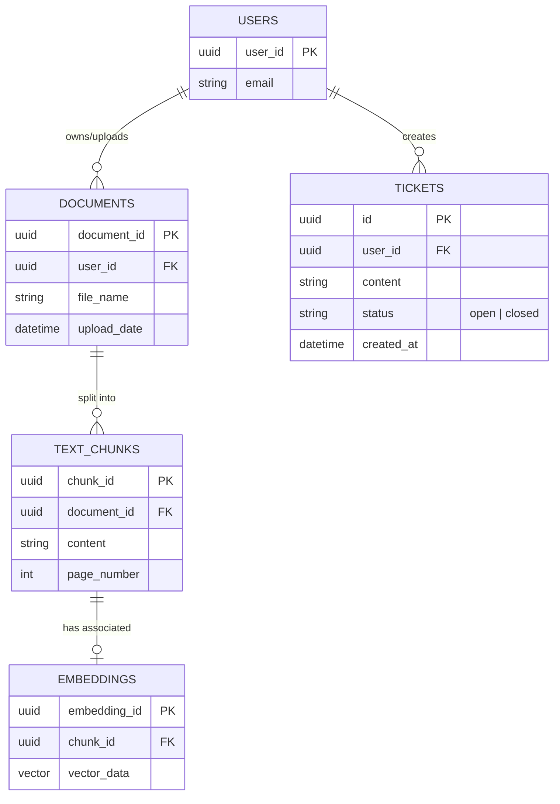

```mermaid
erDiagram
    USERS ||--o{ DOCUMENTS : "owns/uploads"
    USERS ||--o{ TICKETS : "creates"
    DOCUMENTS ||--o{ TEXT_CHUNKS : "split into"
    TEXT_CHUNKS ||--o| EMBEDDINGS : "has associated"

    USERS {
        uuid user_id PK
        string email
    }
    
    DOCUMENTS {
        uuid document_id PK
        uuid user_id FK
        string file_name
        datetime upload_date
    }
    
    TEXT_CHUNKS {
        uuid chunk_id PK
        uuid document_id FK
        string content
        int page_number
    }
    
    EMBEDDINGS {
        uuid embedding_id PK
        uuid chunk_id FK
        vector vector_data
    }
    
    TICKETS {
        uuid id PK
        uuid user_id FK
        string content
        string status "open | closed"
        datetime created_at
    }
```