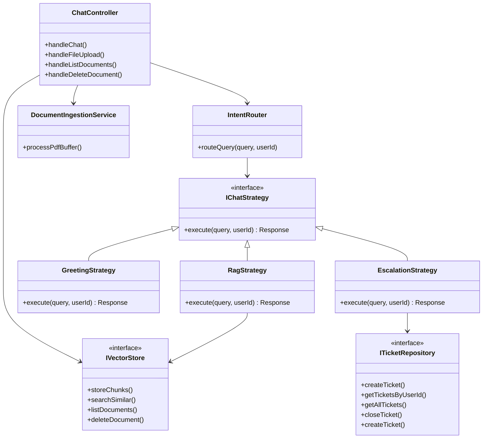

```mermaid
classDiagram
    class ChatController {
        +handleChat()
        +handleFileUpload()
        +handleListDocuments()
        +handleDeleteDocument()
    }
    
    class IntentRouter {
        +routeQuery(query, userId)
    }
    
    class DocumentIngestionService {
        +processPdfBuffer()
    }
    
    class IChatStrategy {
        <<interface>>
        +execute(query, userId) Response
    }
    
    class RagStrategy {
        +execute(query, userId) Response
    }
    
    class GreetingStrategy {
        +execute(query, userId) Response
    }
    
    class EscalationStrategy {
        +execute(query, userId) Response
    }

    class IVectorStore {
        <<interface>>
        +storeChunks()
        +searchSimilar()
        +listDocuments()
        +deleteDocument()
    }

    class ITicketRepository {
        <<interface>>
        +createTicket()
        +getTicketsByUserId()
        +getAllTickets()
        +closeTicket()
    }

    class ITicketRepository {
        <<interface>>
        +createTicket()
    }

    ChatController --> IntentRouter
    ChatController --> DocumentIngestionService
    ChatController --> IVectorStore
    IntentRouter --> IChatStrategy
    IChatStrategy <|-- RagStrategy
    IChatStrategy <|-- GreetingStrategy
    IChatStrategy <|-- EscalationStrategy
    RagStrategy --> IVectorStore
    EscalationStrategy --> ITicketRepository
```