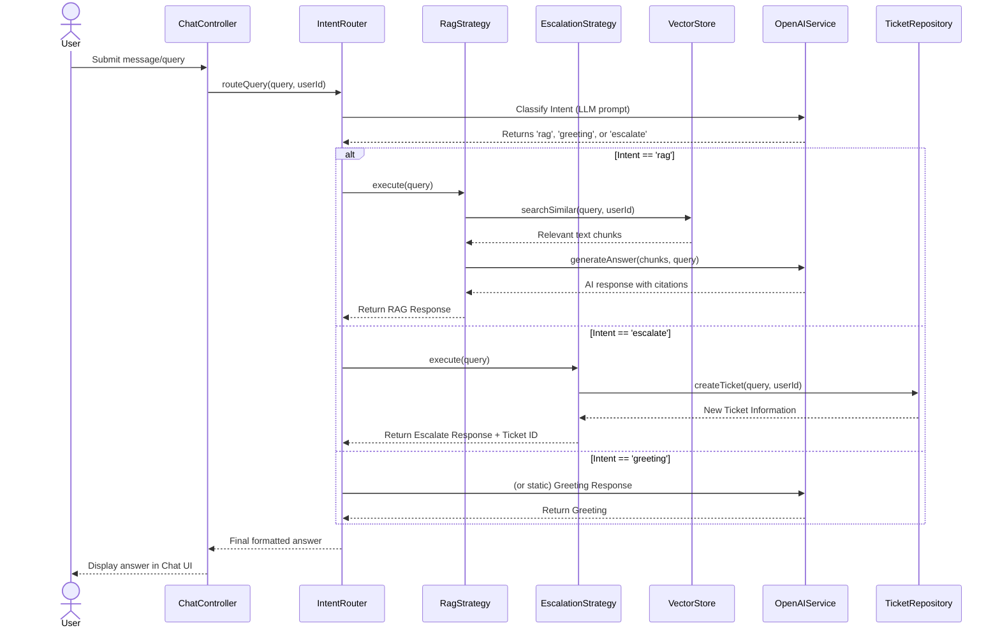

```mermaid
sequenceDiagram
    actor User
    participant API as ChatController
    participant Router as IntentRouter
    participant RAG as RagStrategy
    participant Esc as EscalationStrategy
    participant VDB as VectorStore
    participant LLM as OpenAIService
    participant DB as TicketRepository

    User->>API: Submit message/query
    API->>Router: routeQuery(query, userId)
    Router->>LLM: Classify Intent (LLM prompt)
    LLM-->>Router: Returns 'rag', 'greeting', or 'escalate'

    alt Intent == 'rag'
        Router->>RAG: execute(query)
        RAG->>VDB: searchSimilar(query, userId)
        VDB-->>RAG: Relevant text chunks
        RAG->>LLM: generateAnswer(chunks, query)
        LLM-->>RAG: AI response with citations
        RAG-->>Router: Return RAG Response
    else Intent == 'escalate'
        Router->>Esc: execute(query)
        Esc->>DB: createTicket(query, userId)
        DB-->>Esc: New Ticket Information
        Esc-->>Router: Return Escalate Response + Ticket ID
    else Intent == 'greeting'
        Router->>LLM: (or static) Greeting Response
        LLM-->>Router: Return Greeting
    end

    Router-->>API: Final formatted answer
    API-->>User: Display answer in Chat UI
```