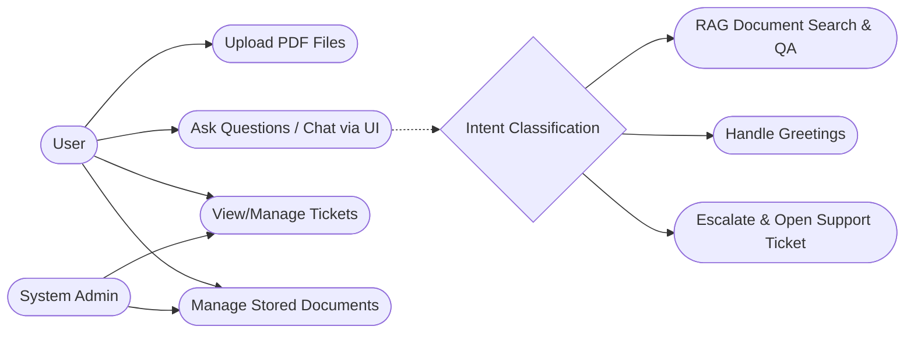

```mermaid
flowchart LR
    User([User])
    Admin([System Admin])
    
    Upload([Upload PDF Files])
    Chat([Ask Questions / Chat via UI])
    Route{Intent Classification}
    RAG([RAG Document Search & QA])
    Greeting([Handle Greetings])
    Escalate([Escalate & Open Support Ticket])
    Tickets([View/Manage Tickets])
    Docs([Manage Stored Documents])
    
    User --> Upload
    User --> Chat
    User --> Docs
    User --> Tickets
    
    Chat -.-> Route
    Route --> RAG
    Route --> Greeting
    Route --> Escalate
    
    Admin --> Docs
    Admin --> Tickets
```